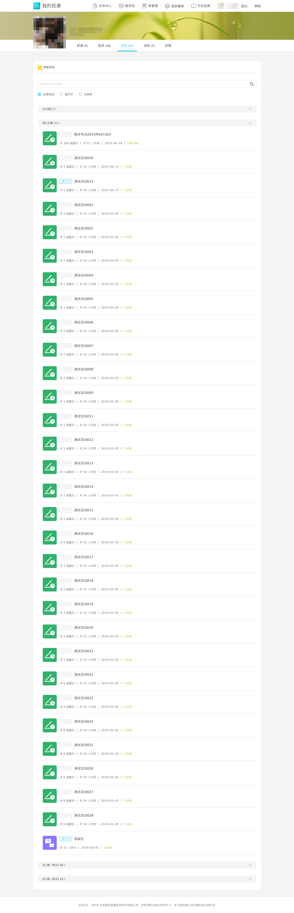

# Lanmoyun-download

批量爬取蓝墨云班课中的习题

----

本程序使用Python3.7.2编写

请使用Python3.6及以上版本，若使用低版本请删去toolbox.py下Toolbox类中变量注释，并查看格式化`{}`方法是否适用于您的Python版本

e.g. 

将:

```python
def get_data(self, url: str) -> list:
```

修改为:

```python
def get_data(self, url):
```

将:

```python
title.append(html.xpath(f'/html/body/div[3]/div[2]/div[4]/div[{i + 1}]/div[1]/div/div[1]/div/div[3]/pre/text()'))
```

修改为:

```python
title.append(html.xpath('/html/body/div[3]/div[2]/div[4]/div[%]/div[1]/div/div[1]/div/div[3]/pre/text()' % str(i + 1))
```

----

## 安装依赖：

`pip install requests`

`pip install lxml`

`pip install tqdm`

----

## 注意事项

- 本程序默认自动重连次数为10次(`for r in range(10):`)，重连等待时间为5秒(`time.sleep(5)`)，爬取网页等待时间为2秒(`time.sleep(2)`)，文件为程序所在目录下的**Sum.txt**(`with open('Sum.txt', 'a+') as f:`)。如需修改请在**data.py**文件中添加您需要的数值

- 本程序已构建可执行.exe文件，Windows平台可直接下载运行

- **Lanmoyun_scrapy**框架已完善, 请先修改**start.py**中的`url`及`cookie`, 然后修改**Lanmoyun_scrapy**中的**settings.py**中的`DEFAULT_REQUEST_HEADERS`, 最后运行**start.py**文件

----

## 已解决问题：

1. 批量爬取蓝墨云班课活动

2. 题目统一编号整理后写入统一文档--v2.0

3. Session会话管理--v2.1

6. tqdm加入进度条

7. 完善Lanmoyun_scrapy

----

## 待解决问题：

1.将题目以首字母拼音升序排列(拟用pypinyin库构建)

2.改用asyncio + aiohttp + ThreadPoolExecutor进行高并发多线程爬取

## 运行程序

`python main.py`

按照终端提示依次输入用户名、密码及网址

注: 网址为您课程下题目集合的网址

