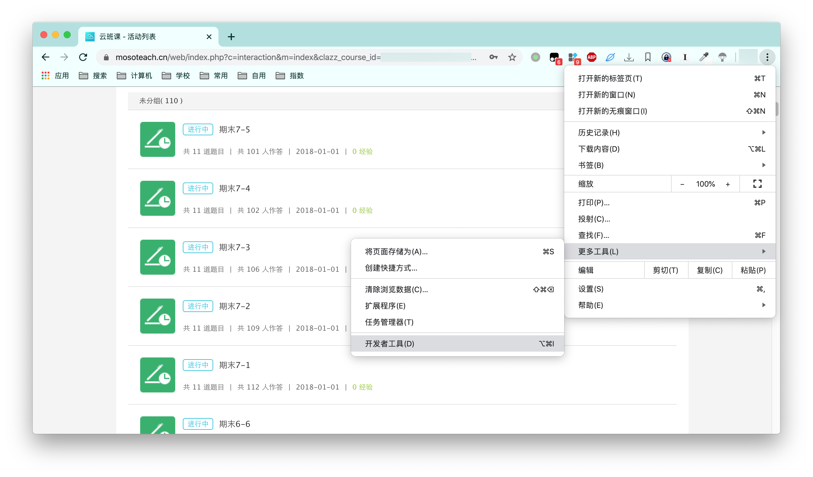
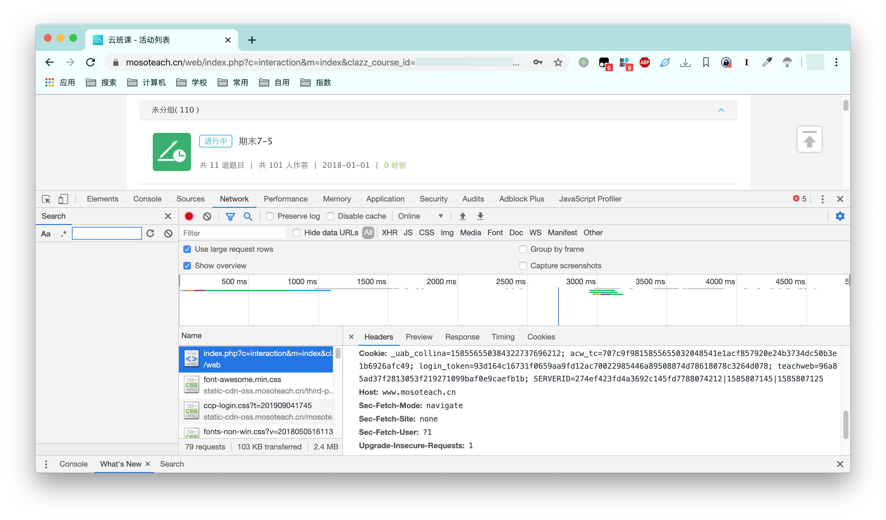
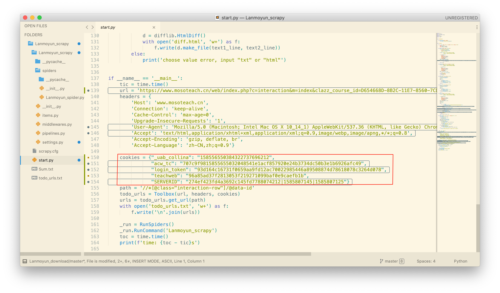
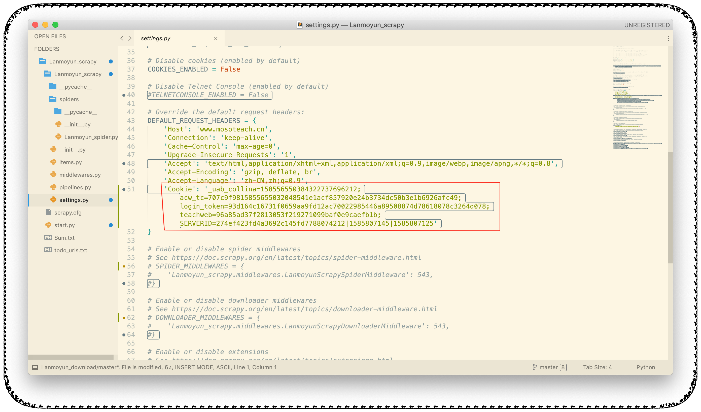
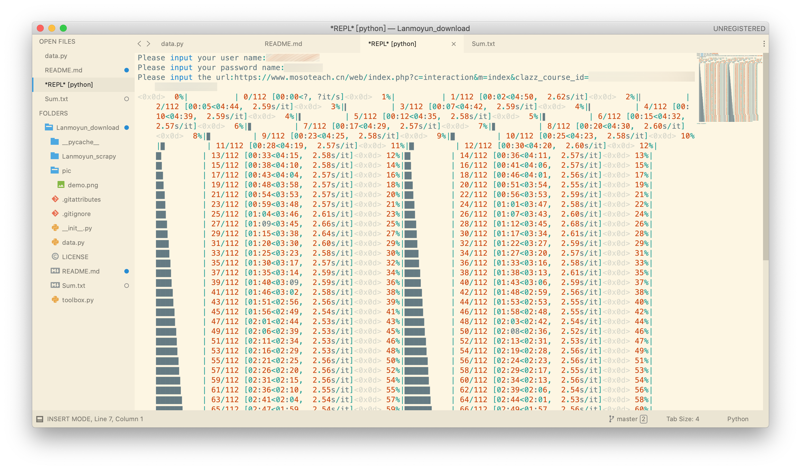
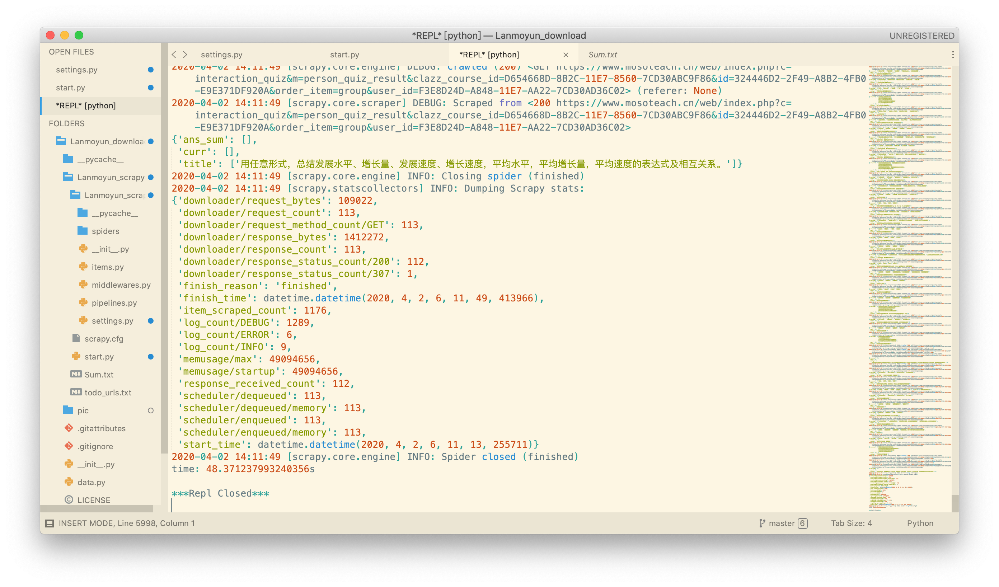
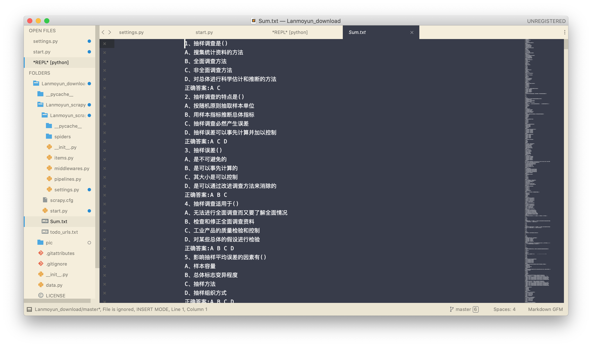
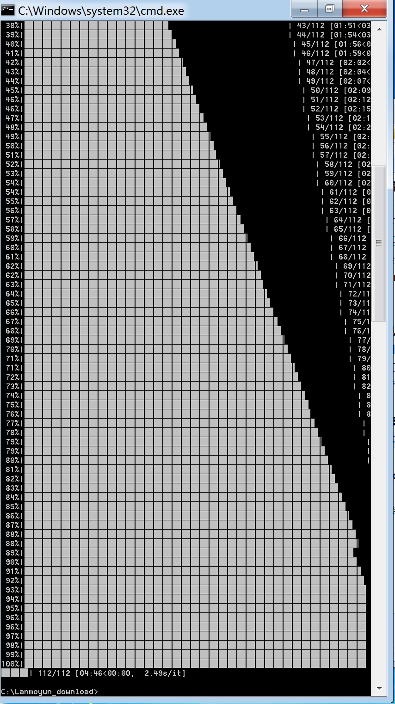
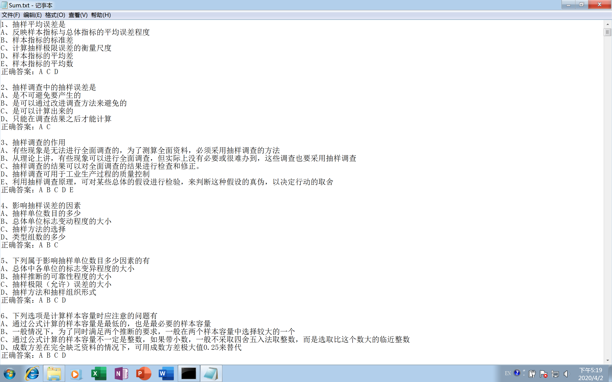

# Lanmoyun-download

批量爬取蓝墨云班课中的习题

---

本程序使用Python3.7.2编写

请使用Python3.6及以上版本，若使用低版本请删去toolbox.py下Toolbox类中变量注释，并查看格式化`{}`方法是否适用于您的Python版本

e.g. 

将:

```python
def get_data(self, url: str) -> list:
```

修改为:

```python
def get_data(self, url):
```

将:

```python
title.append(html.xpath(f'/html/body/div[3]/div[2]/div[4]/div[{i + 1}]/div[1]/div/div[1]/div/div[3]/pre/text()'))
```

修改为:

```python
title.append(html.xpath('/html/body/div[3]/div[2]/div[4]/div[%]/div[1]/div/div[1]/div/div[3]/pre/text()' % str(i + 1))
```

---

## 目录
- [Lanmoyun-download](#lanmoyun-download)
  * [1 安装依赖](#1-安装依赖)
  * [2 注意事项](#2-注意事项)
  * [3 已解决问题](#3-已解决问题)
  * [4 待解决问题](#4-待解决问题)
  * [5 运行程序](#5-运行程序)
  * [6 Scrapy框架使用](#6-Scrapy框架使用)
    + [6.1 安装框架与依赖](#61-安装框架与依赖)
    + [6.2 修改参数](#62-修改参数)
    + [6.3 运行程序](#63-运行程序)
  * [7 测试日志](#7-测试日志)
    + [7.1 2020年4月2日检测结果](#71-2020年4月2日检测结果)

---

## 1 安装依赖

`pip install requests`

`pip install lxml`

`pip install tqdm`

----

## 2 注意事项

- 本程序默认自动重连次数为10次(`for r in range(10):`)，重连等待时间为5秒(`time.sleep(5)`)，爬取网页等待时间为2秒(`time.sleep(2)`)，文件为程序所在目录下的**Sum.txt**(`with open('Sum.txt', 'a+') as f:`)。如需修改请在**data.py**文件中添加您需要的数值

- 本程序已构建可执行.exe文件，Windows平台可直接下载运行

- **Lanmoyun_scrapy**框架已完善, 请先修改**start.py**中的`url`及`cookie`, 然后修改**Lanmoyun_scrapy**中的**settings.py**中的`DEFAULT_REQUEST_HEADERS`, 最后运行**start.py**文件

- 刷答案方面，不建议用Python，因为对网页进行Javascript注入没有原生程序便捷。以多选题为例，下附Javascript代码:

  ```javascript
  # 选取多选题选项框
  answer_list = document.getElementsByTagName("i")
  # 判断总个数，并逐一选取
  for(i=0;i<answer_list.length;i++) {answer_list[i].click()}
  ```

  若出现单选，则判断个数后用总数除以选项分组。为确保刷题的真实性，可添加随机选取，修改i++，用random()函数结合自身页面进行调整

  用法:

  以Chrome浏览器为例:

  1. 单击右上角3个点
  2. 单击更多工具
  3. 单击**开发者工具**(注: 每个浏览器的开发者工具位置大体一致)
  4. 单击Console后输入javascript代码(注: Firefox浏览器为**控制台**)
  
- **请小白同学们尽量使用第一种爬虫程序，`Scrapy`框架可能即便是下载并安装就大概率出现不同的Bug**

- 请提交issue时尽量附加错误代码

- 在`issue#4`中发现`Windows10`需要以管理员身份运行`exe`程序，请**右键单击程序**，选择**以管理员身份运行**。

----

## 3 已解决问题

 * [x] 批量爬取蓝墨云班课活动

 * [x] 题目统一编号整理后写入统一文档--v2.0

 * [x] Session会话管理--v2.1

 * [x] tqdm加入进度条

 * [x] 完善Lanmoyun_scrapy

----

## 4 待解决问题

1.将题目以首字母拼音升序排列(拟用pypinyin库构建)

2.改用asyncio + aiohttp + ThreadPoolExecutor进行高并发多线程爬取

## 5 运行程序

`python data.py`

按照终端提示依次输入用户名、密码及网址

注: 网址为您课程下题目集合的网址


## 6 Scrapy框架使用

本程序分两个部分，`data.py`和`toolbox.py`文件为`requests`库与`lxml`库构建程序，与`Lanmoyun_scrapy`文件夹所构建的`scrapy`框架爬虫无关。试验`scrapy`程序是出于本人对于其速度的好奇，若新手使用建议进行步骤1-5的操作。如果喜欢折腾框架，欢迎按照一下步骤操作:

### 6.1 安装框架与依赖

`pip install scrapy`

`pip install requests`

`pip install lxml`

如果需要其他安装方式，请参阅[Scrapy官方使用手册](https://scrapy-chs.readthedocs.io/zh_CN/1.0/intro/install.html)

### 6.2 修改参数

1. 在PC端登陆您的蓝墨云，查看网站`cookie`。以`Chrome`为例：点击右上**三个点** -> **更多工具** -> **开发者工具**



2. 点击`Network`，找到所在页面并点击，查看`Headers`，下拉寻找`Cookie`



3. 根据第2步的`Cookie`修改`Scrapy`爬虫配置文件：

- 修改`Lanmoyun_scrapy/start.py`中`cookies`(**注意：此参数为Python中的dict类型数据结构**):



- 修改`Lanmoyun_scrapy/Lanmoyun_scrapy/settings.py`中`Cookie`**(注意：此参数为Python中的str类型数据结构**)



### 6.3 运行程序

`python ./Lanmoyun_scrapy/start.py`


运行完毕后查看`./Lanmoyun_scrapy/Sum.txt`即可，如需爬取其他页面题目，请确保`./Lanmoyun_scrapy/todo_urls.txt`为空。

---

## 7 测试日志

### 7.1 2020年4月2日检测结果

​        起初开发本程序只是方便本人和同学使用，为了便于存储分享与版本管理在Github上发布，未考虑太多关于兼容性的问题。

​        由于受疫情影响，这段时间本程序使用人数也在增加，相应可能会出现部分未发现的问题，欢迎大家提交issue与修改Bug。因为本人为大四学生，现准备出国和毕业论文中，已经不用蓝墨云班课1年的时间。如果蓝墨云有api改动或者是其他问题，请提交后耐心等待，我会尽力尽快修改。另: 请各位联系是最好提交issue。因为今天查看邮箱，发现QQ邮件被自动归为垃圾邮件，所以可能会漏看消息或者是查看不及时，请各位谅解。

​        关于exe使用问题: 本人电脑为`MacBookPro`，系统为`macOS Catalina 10.15.4 (19E266)`，测试用虚拟机为`Windows7`系统。所以可能在`Windows10`系统中出现未能复现的Bug，我将尽可能发布可用的exe版本。

​        今日进行测试时，源码程序未表现异常，二进制可执行文件未表现异常，均可正常使用。**请使用时务必检查好您的运行环境。**

**测试结果:** 

1. 基于`requests`与`lxml`库程序表现: 




2. 基于`scrapy`框架爬虫表现:





3. 二进制可执行文件表现:




