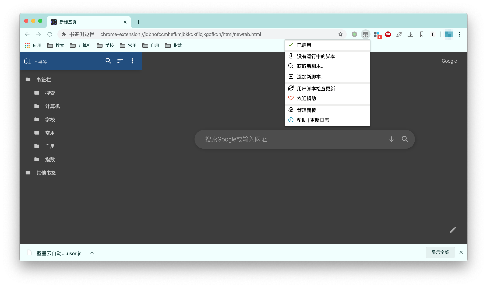
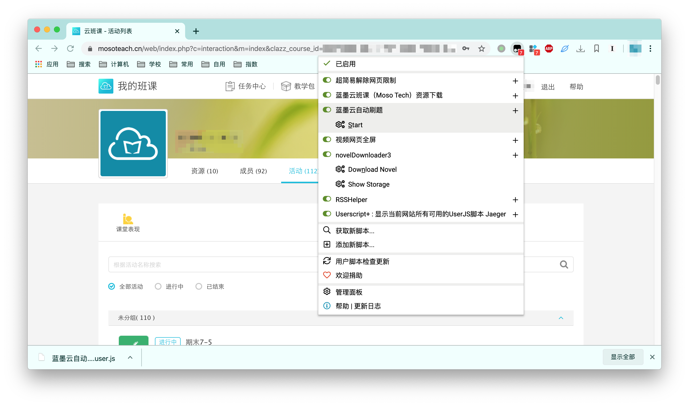

# Lanmoyun-download

## 目录

- [1 安装依赖](#1-安装依赖)
- [2 注意事项](#2-注意事项)
- [3 已解决问题](#3-已解决问题)
- [4 待解决问题](#4-待解决问题)
- [5 运行程序](#5-运行程序)
- [6 Scrapy框架使用](#6-Scrapy框架使用)
  * [6.1 安装框架与依赖](#61-安装框架与依赖)
  * [6.2 修改参数](#62-修改参数)
  * [6.3 运行程序](#63-运行程序)
- [7 油猴自动刷题脚本](#7-油猴自动刷题脚本)
  * [7.1 免责声明](#71-免责声明)
  * [7.2 安装油猴插件](#72-安装油猴插件)
  * [7.3 运行程序](#73-运行程序)
  * [7.4 参数调整](#74-参数调整)
  * [7.5 待解决问题](#73-待解决问题)
- [8 测试日志](#8-测试日志)
  * [8.1 2020年4月2日检测结果](#81-2020年4月2日检测结果)

---

## 1 安装依赖

`pip install requests`

`pip install lxml`

`pip install tqdm`

----

## 2 注意事项

- 本程序使用Python3.7.2编写

    请使用Python3.6及以上版本，若使用低版本请删去toolbox.py下Toolbox类中变量注释，并查看格式化`{}`方法是否适用于您的Python版本

    e.g. 

    将:

   ```python
   def get_data(self, url: str) -> list:
   ```

    修改为:

    ```python
    def get_data(self, url):
    ```

    将:
   
    ```python
    title.append(html.xpath(f'/html/body/div[3]/div[2]/div[4]/div[{i + 1}]/div[1]/div/div[1]/div/div[3]/pre/text()'))
    ```

    修改为:

    ```python
    title.append(html.xpath('/html/body/div[3]/div[2]/div[4]/div[%]/div[1]/div/div[1]/div/div[3]/pre/text()' % str(i + 1))
    ```

- 本程序默认自动重连次数为10次(`for r in range(10):`)，重连等待时间为5秒(`time.sleep(5)`)，爬取网页等待时间为2秒(`time.sleep(2)`)，文件为程序所在目录下的**Sum.txt**(`with open('Sum.txt', 'a+') as f:`)。如需修改请在**data.py**文件中添加您需要的数值

- 本程序已构建可执行.exe文件，Windows平台可直接下载运行。在[`issue#4`](https://github.com/congyewang/Lanmoyun_download/issues/4)中初步发现`Windows10`需要以管理员身份运行`exe`程序，请**右键单击程序**，选择**以管理员身份运行**。

- **Lanmoyun_scrapy**框架已完善, 请先修改**start.py**中的`url`及`cookie`, 然后修改**Lanmoyun_scrapy**中的**settings.py**中的`DEFAULT_REQUEST_HEADERS`, 最后运行**start.py**文件

- 刷答案方面，不建议用Python，因为对网页进行Javascript注入没有原生程序便捷。以多选题为例，下附Javascript代码:

  ```javascript
  # 选取多选题选项框
  answer_list = document.getElementsByTagName("i")
  # 判断总个数，并逐一选取
  for(i=0;i<answer_list.length;i++) {answer_list[i].click()}
  ```

  若出现单选，则判断个数后用总数除以选项分组。为确保刷题的真实性，可添加随机选取，修改i++，用Math.random()函数结合自身页面进行调整

  用法:

  以Chrome浏览器为例:

  1. 单击右上角3个点
  2. 单击更多工具
  3. 单击**开发者工具**(注: 每个浏览器的开发者工具位置大体一致)
  4. 单击Console后输入javascript代码(注: Firefox浏览器为**控制台**)
  
- **请小白同学们尽量使用第一种爬虫程序，`Scrapy`框架可能即便是下载并安装就大概率出现不同的Bug**

- 请提交issue时尽量附加错误代码

----

## 3 已解决问题

 * [x] 批量爬取蓝墨云班课活动

 * [x] 题目统一编号整理后写入统一文档--v2.0

 * [x] Session会话管理--v2.1

 * [x] tqdm加入进度条

 * [x] 完善Lanmoyun_scrapy

----

## 4 待解决问题

 * [ ] 将题目以首字母拼音升序排列(拟用pypinyin库构建)
 * [ ] 改用asyncio + aiohttp + ThreadPoolExecutor进行高并发多线程爬取
 * [ ] 自动刷题

---

## 5 运行程序

`python data.py`

按照终端提示依次输入用户名、密码及网址

注: 网址为您课程下题目集合的网址


---

## 6 Scrapy框架使用

本程序分两个部分，`data.py`和`toolbox.py`文件为`requests`库与`lxml`库构建程序，与`Lanmoyun_scrapy`文件夹所构建的`scrapy`框架爬虫无关。试验`scrapy`程序是出于本人对于其速度的好奇，若新手使用建议进行步骤1-5的操作。如果喜欢折腾框架，欢迎按照一下步骤操作:

### 6.1 安装框架与依赖

`pip install scrapy`

`pip install requests`

`pip install lxml`

如果需要其他安装方式，请参阅[Scrapy官方使用手册](https://scrapy-chs.readthedocs.io/zh_CN/1.0/intro/install.html)

### 6.2 修改参数

1. 在PC端登陆您的蓝墨云，查看网站`cookie`。以`Chrome`为例：点击右上**三个点** -> **更多工具** -> **开发者工具**


2. 点击`Network`，找到所在页面并点击，查看`Headers`，下拉寻找`Cookie`


3. 根据第2步的`Cookie`修改`Scrapy`爬虫配置文件：

- 修改`Lanmoyun_scrapy/start.py`中`cookies`(**注意：此参数为Python中的dict类型数据结构**):


- 修改`Lanmoyun_scrapy/Lanmoyun_scrapy/settings.py`中`Cookie`**(注意：此参数为Python中的str类型数据结构**)


### 6.3 运行程序

`python ./Lanmoyun_scrapy/start.py`


运行完毕后查看`./Lanmoyun_scrapy/Sum.txt`即可，如需爬取其他页面题目，请确保`./Lanmoyun_scrapy/todo_urls.txt`为空。

---

## 7 油猴自动刷题脚本

### 7.1 免责声明

**免责声明：根据本项目使用的GPL3.0协议中第15、16项:**

> **15. Disclaimer of Warranty.**
>
> THERE IS NO WARRANTY FOR THE PROGRAM, TO THE EXTENT PERMITTED BY APPLICABLE LAW. EXCEPT WHEN OTHERWISE STATED IN WRITING THE COPYRIGHT HOLDERS AND/OR OTHER PARTIES PROVIDE THE PROGRAM “AS IS” WITHOUT WARRANTY OF ANY KIND, EITHER EXPRESSED OR IMPLIED, INCLUDING, BUT NOT LIMITED TO, THE IMPLIED WARRANTIES OF MERCHANTABILITY AND FITNESS FOR A PARTICULAR PURPOSE. THE ENTIRE RISK AS TO THE QUALITY AND PERFORMANCE OF THE PROGRAM IS WITH YOU. SHOULD THE PROGRAM PROVE DEFECTIVE, YOU ASSUME THE COST OF ALL NECESSARY SERVICING, REPAIR OR CORRECTION.
>
> **16. Limitation of Liability.**
>
> IN NO EVENT UNLESS REQUIRED BY APPLICABLE LAW OR AGREED TO IN WRITING WILL ANY COPYRIGHT HOLDER, OR ANY OTHER PARTY WHO MODIFIES AND/OR CONVEYS THE PROGRAM AS PERMITTED ABOVE, BE LIABLE TO YOU FOR DAMAGES, INCLUDING ANY GENERAL, SPECIAL, INCIDENTAL OR CONSEQUENTIAL DAMAGES ARISING OUT OF THE USE OR INABILITY TO USE THE PROGRAM (INCLUDING BUT NOT LIMITED TO LOSS OF DATA OR DATA BEING RENDERED INACCURATE OR LOSSES SUSTAINED BY YOU OR THIRD PARTIES OR A FAILURE OF THE PROGRAM TO OPERATE WITH ANY OTHER PROGRAMS), EVEN IF SUCH HOLDER OR OTHER PARTY HAS BEEN ADVISED OF THE POSSIBILITY OF SUCH DAMAGES.

​       **本段代码旨在学习JavaScript的一点实践，只作为学习与交流，不可使用于商业和个人其他意图。若使用不当，后果均由个人承担。此功仅能为测试功能，您应明确理解并同意，您使用此段代码的风险将由您自行承担，开发者不承担使用后带来的任何负面影响与法律责任。**

### 7.2 安装油猴插件

Tampermonkey 是一款浏览器脚本管理插件，常见浏览器都支持，结合脚本网站 Greasyfork，能够方便的实现脚本旳一键安装、自动更新、快速启用等便捷功能。

1. **打开 [Tampermonkey.net](http://tampermonkey.net/) 官网，安装对应版本的插件**

​        **注**：chrome 可以通过网站 [crx4chrome](https://www.crx4chrome.com/) 来下载扩展程序 crx 文件，手动将 crx 文件拖动至扩展页面安装即可。安装好后自动启用，扩展区域会出现相应扩展图标。


2. 点击**管理面板 -> 实用工具 -> 文件导入**，安装**TampermonkeyScript**下的**蓝墨云自动刷题.user.js**脚本





### 7.3 运行程序

加载成功后进入活动列表网页，点击菜单上**Start**键开始


### 7.4 参数调整

```javascript
// @match        https://www.mosoteach.cn/web/index.php?c=interaction_quiz*
// @match        https://www.mosoteach.cn/web/index.php?c=interaction&m=index&clazz_course_id=*
```

上述代码为油猴脚本允许代码执行网站，若在您的电脑上刷新不出插件，则可以添加语句`// @match *`后刷新使用。

```javascript
for (let j = 0; j < answer_list.length; j++) {answer_list[j].click()};
```

上述代码为执行单击事件，j++为自增，若希望单选题全为A、B、C等，可依次改动代码`j = 1;...;j = j + 4`、`j = 2;...;j = j + 4`、`j = 3;...;j = j + 4`。若希望判断题全为对，则可改动代码`j = 0;...;j = j + 2`

### 7.5 待解决功能

 * [ ] 基于题型判断点击选项

 * [ ] 随机点击选项

---

## 8 测试日志

### 8.1 2020年4月2日检测结果

​        起初开发本程序只是方便本人和同学使用，为了便于存储分享与版本管理在Github上发布，未考虑太多关于兼容性的问题。

​        由于受疫情影响，这段时间本程序使用人数也在增加，相应可能会出现部分未发现的问题，欢迎大家提交issue与修改Bug。因为本人为大四学生，现准备出国和毕业论文中，已经不用蓝墨云班课1年的时间。如果蓝墨云有api改动或者是其他问题，请提交后耐心等待，我会尽力尽快修改。另: 请各位联系是最好提交issue。因为今天查看邮箱，发现QQ邮件被自动归为垃圾邮件，所以可能会漏看消息或者是查看不及时，请各位谅解。

​        关于exe使用问题: 本人电脑为`MacBookPro`，系统为`macOS Catalina 10.15.4 (19E266)`，测试用虚拟机为`Windows7`系统。所以可能在`Windows10`系统中出现未能复现的Bug，我将尽可能发布可用的exe版本。

​        今日进行测试时，源码程序未表现异常，二进制可执行文件未表现异常，均可正常使用。**请使用时务必检查好您的运行环境。**

**测试结果:** 

1. 基于`requests`与`lxml`库程序表现: 


2. 基于`scrapy`框架爬虫表现:


3. 二进制可执行文件表现:


